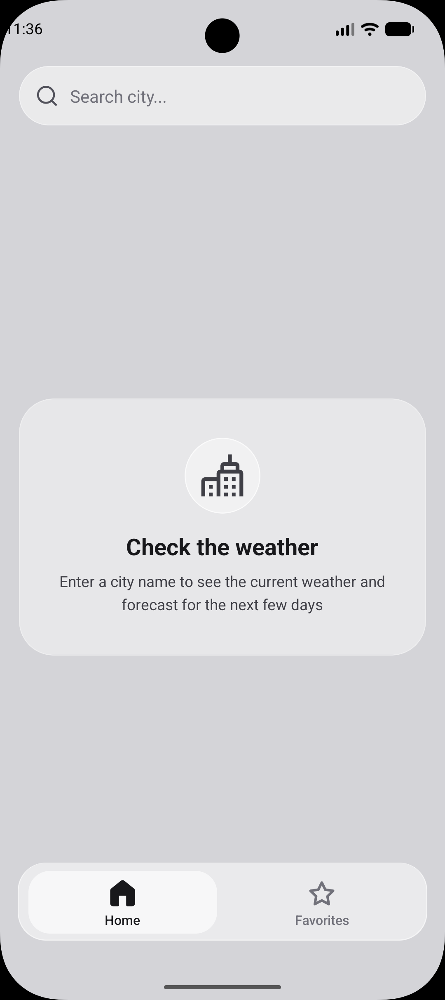
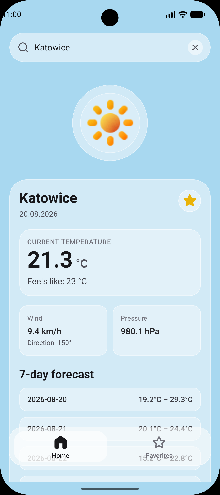
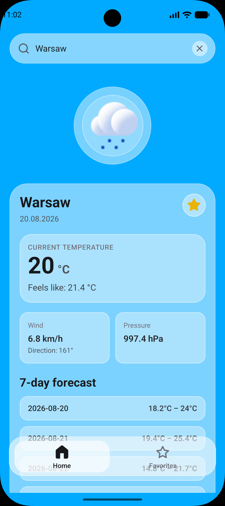
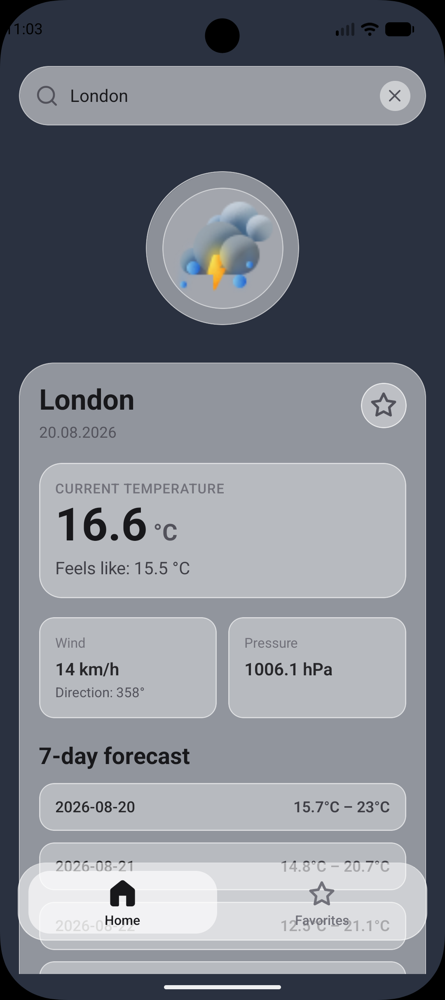

# ⛅ Weather - _mobile application_

This is a weather application built with React Native and Expo that provides current weather information and a 7-day forecast for any city in the world. The app uses two APIs from Open-Meteo: the Geocoding API to convert city names into geographic coordinates, and the Weather API to fetch real-time weather data for those coordinates. When you type a city name into the search input, the app retrieves the location data and displays detailed weather information including current temperature, feels-like temperature, wind speed and direction, atmospheric pressure, and a weather icon that matches the current conditions

The user interface features a modern glass design with translucent cards, blur effects, and subtle white borders that create a clean and premium look the application. The background color changes dynamically based on the current weather conditions of the displayed city, with smooth animated transitions between different weather states. Users can add any city to their favorites list by tapping the star icon, and all favorite locations are saved to AsyncStorage so they persist after closing and reopening the app. The Favorites tab displays all saved cities with their current weather information and allows users to remove locations from the list with a single tap

<p align="center">
  
  
  
  
</p>

## ⚙️ Technologies

[](https://skillicons.dev)

## ⭐ Features

- Search for any city by name and get instant weather information
- Displays current temperature, feels-like temperature, wind, and atmospheric pressure
- Shows a 7-day weather forecast
- Dynamic weather icons that change based on current weather
- Animated background that adapts to the weather of the searched city
- Glass design with blur effects, translucent cards, and modern UI elements
- Add and remove cities to/from favorites list
- Storage of favorite locations using AsyncStorage
- Two-tab navigation with Home and Favorites screens
- Empty state and loading state views for better user experience

## 🚦 Get Started

1. Install dependencies

   ```bash
   npm install
   ```

2. Start the app

   ```bash
   npx expo start
   ```

## 🔎 See Also

- [My Website](https://pj-portfolio-cv.vercel.app)
- [My GitHub profile](https://github.com/OKE225)
